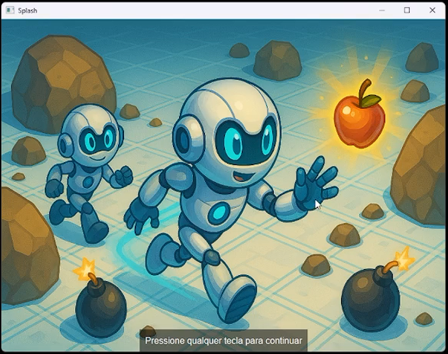
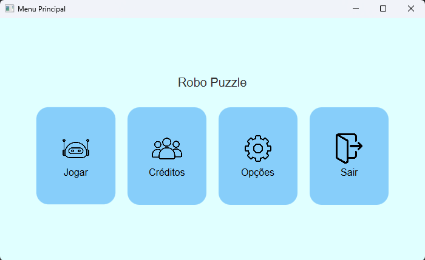
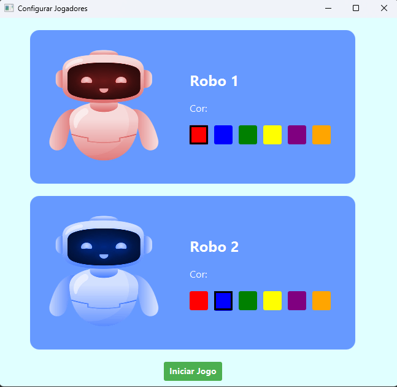
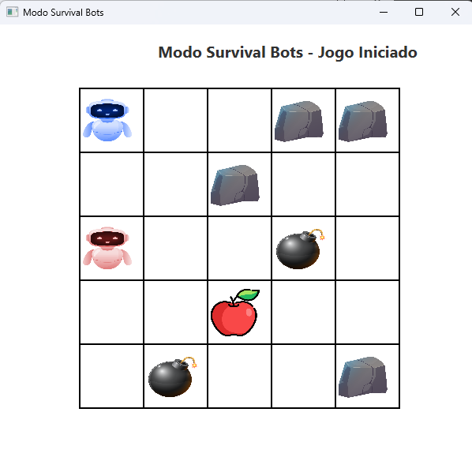
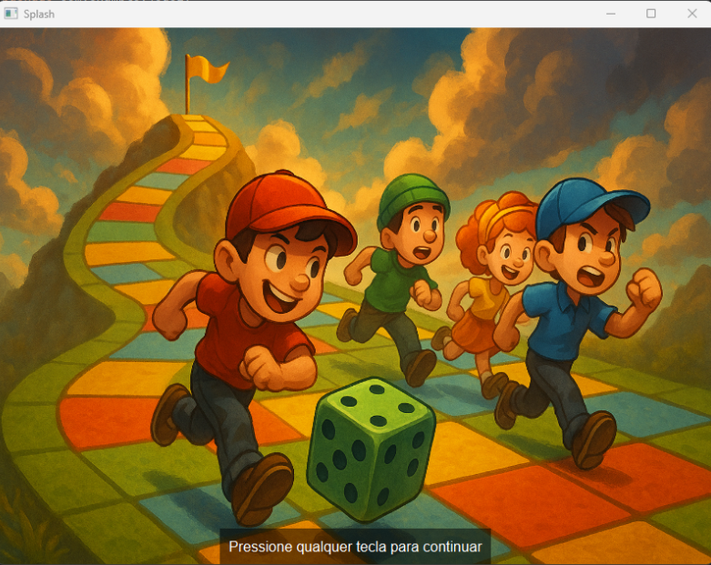
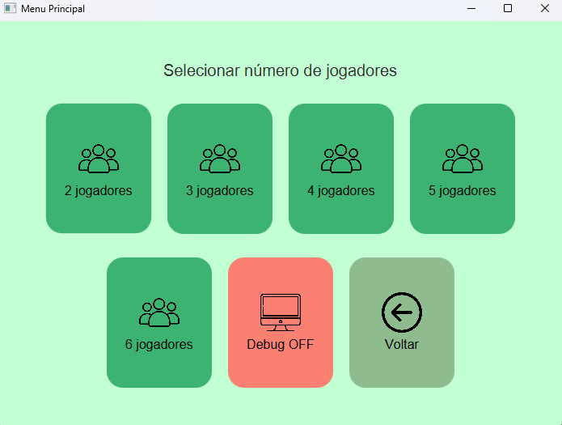
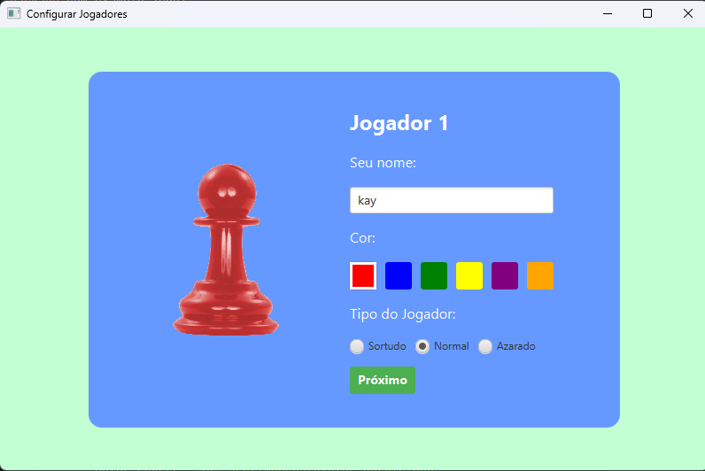
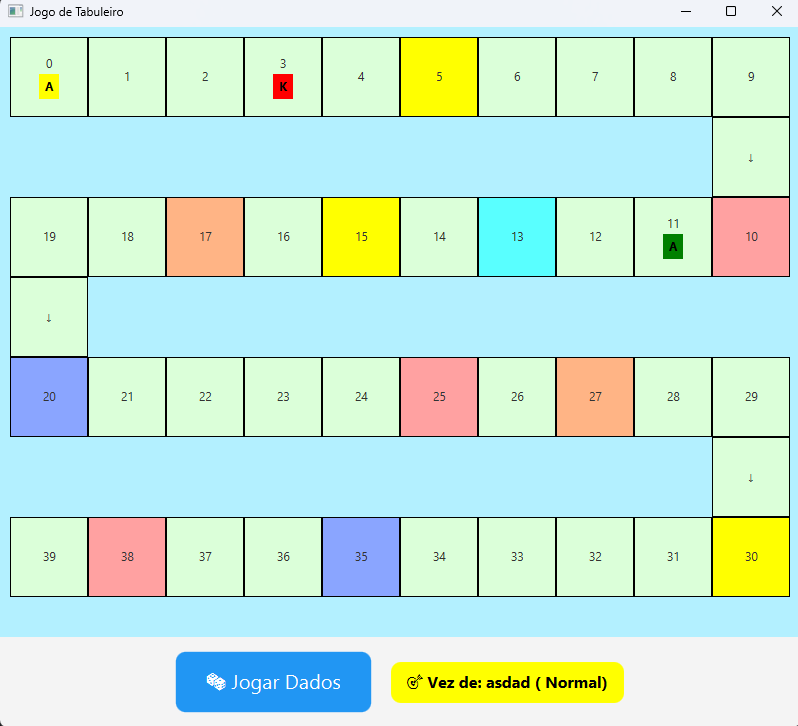

# 🎮 Projetos de Programação Orientada a Objetos (POO)

Este repositório contém dois jogos desenvolvidos como requisitos avaliativos para a cadeira de **Programação Orientada a Objetos** na **Universidade Estadual do Ceará (UECE)**. Ambos os projetos foram construídos **inteiramente utilizando a linguagem Java e a biblioteca gráfica JavaFX**, sem o uso de engines externas, focando na aplicação pura dos conceitos de POO.

---

## 🎲 1. Jogo de Tabuleiro em Trilha

Um jogo de tabuleiro clássico onde a estratégia e a sorte caminham juntas. O objetivo é atravessar a trilha e chegar ao final antes dos adversários. Este jogo utiliza **JavaFX** para renderizar dinamicamente o tabuleiro e os elementos de interface.

### 🛠️ Mecânicas e Funcionalidades
* **Desenvolvimento 100% Java:** Toda a lógica de jogo e interface gráfica foram criadas utilizando Java e JavaFX.
* **Multijogador:** Suporte para múltiplos jogadores por partida.
* **Casas Especiais:** O tabuleiro contém casas de "Sorte ou Azar" que podem conceder vantagens (avançar casas) ou desvantagens (retroceder ou perder o turno).
* **Lógica de Turnos:** Sistema robusto de gerenciamento de rodadas.

### 📸 Galeria de fotos e Gameplay (Tabuleiro)
> **💡 Dica:** Clique na primeira imagem para assistir à demonstração da lógica do jogo!

|  |
|:---:|
| 🎬 *ASSISTIR DEMONSTRAÇÃO DO TABULEIRO* |

| 🏫 *Visual do Tabuleiro* | 🏖️ *Evento de Vantagem* | 🏐 *Vencedor* |
|:---:|:---:|:---:|
|  |  |  |

---

## 🤖 2. Desafio dos Robôs (Malha Quadriculada)

Um jogo de simulação e controle em uma malha quadriculada desenvolvido com **Java puro**, onde o objetivo é levar o robô até o seu "alimento" (objetivo).

### 🕹️ Modos de Jogo
1. **Modo Manual:** Você assume o controle total do robô e deve traçar o caminho até o objetivo.
2. **Modo IA (Inteligência Artificial):** O robô é controlado por um algoritmo que busca autonomamente o caminho mais eficiente até o alimento.
3. **Modo Customizado:** Permite ao usuário posicionar obstáculos na malha para criar novos desafios.

|  |
|:---:|
| 🎬 *ASSISTIR DEMONSTRAÇÃO DO SISTEMA DE ROBÔS* |

### 📸 Galeria de fotos e Gameplay (Robôs)
| *🌆 Malha Quadriculada* | *🥥 Robô vs Alimento* | *🏐 Obstáculos Customizados* |
|:---:|:---:|:---:|
|  |  |  |

## 📚 Conceitos de POO Aplicados

Em ambos os jogos, foram aplicados os pilares fundamentais da Orientação a Objetos aprendidos na UECE, utilizando as capacidades nativas do **Java**:

* **Encapsulamento:** Proteção dos atributos dos jogadores e robôs através de modificadores de acesso.
* **Herança:** Criação de classes base para os tipos de casas do tabuleiro e tipos de robôs, facilitando a extensão do código.
* **Polimorfismo:** Diferentes comportamentos para o movimento do robô (Manual vs IA) e efeitos de casas usando sobrescrita de métodos.
* **Abstração:** Modelagem das regras de negócio de forma modular, separando a lógica de interface (JavaFX) da lógica de backend (Java).

## 🚀 Como Executar

1. **Pré-requisitos:** Certifique-se de ter o **JDK 25** (ou superior) instalado, uma vez que o projeto utiliza as bibliotecas mais recentes do **Java e JavaFX**.
2. **Execução:**
    * Clone o repositório.
    * Abra o projeto no **IntelliJ IDEA**.
    * isntale na estrutura do projeto o openjfx e Execute a classe `Main.java` correspondente ao jogo que deseja testar.
